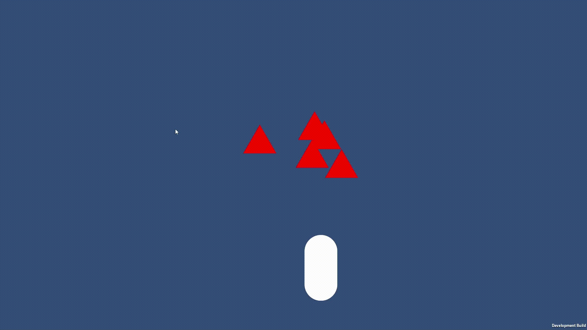

# Probe

Probe is a Unity runtime debugging tool that allows tweaking gameplay variables in build, without rebuilds, without coupling tooling to gameplay, and with explicit release safety.

<!-- Demo -->

  

## Problem

In real Unity production:

- builds are slow,
- debugging in build is painful,
- gameplay tuning requires recompilation,
- some issues only reproduce outside the editor.

Iteration becomes expensive when fast feedback matters most.

## What Probe does

Probe lets you explicitly expose selected gameplay variables and tweak them at runtime, including in build.

Gameplay code remains unaware of Probe.

## Principles

- **Gameplay is independent**  
  Probe never becomes a dependency of gameplay.

- **Explicit over magic**  
  Variables are registered via explicit getters and setters.

- **Tooling at the edge**  
  Probe observes and modifies gameplay without owning it.

- **Removable by design**  
  Probe can be disabled or removed without touching gameplay.

## Architecture (high level)

- Typed variable registry (`Func<T>` / `Action<T>`)
- Explicit binding layer
- Activation policy controlling when Probe can run
- Minimal runtime UI used only to prove the core works

## Activation policy

Probe execution is explicitly gated:

- Editor
- Development builds
- Disabled in release

No unintended impact on final builds.

## Status

Probe is stable and used for runtime debugging and gameplay tuning.
